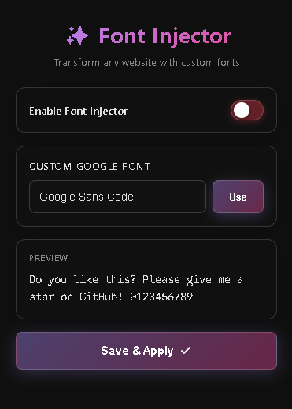

# Custom Font Injector

Inject any Google Font into any website. Simple, clean, and works everywhere.

## Features

- 🎨 Use any Google Font on any website
- 🔄 Real-time preview
- 💾 Settings are saved automatically
- 🎯 Works on all websites
- ✨ Modern glassmorphism UI

## Installation

### Chrome / Edge / Brave / Opera / Opera GX

1. Download or clone this repository
2. Open your browser and go to the extensions page:
   - **Chrome**: `chrome://extensions/`
   - **Brave**: `brave://extensions/`
   - **Opera GX**: `opera://extensions/`
3. Enable "Developer mode" (toggle in the top right)
4. Click "Load unpacked"
5. Select the folder containing the extension files
6. Done! The extension icon should appear in your toolbar

For permanent installation in Firefox:
- You'll need to package it as a `.xpi` file or publish it on Firefox Add-ons

## How to Use

1. Click the extension icon in your toolbar
2. Toggle "Enable Font Injector" to ON (green)
3. Type any Google Font name in the input field (e.g., "Inter", "Roboto", "Poppins")
4. Click "Use" to preview
5. Click "Save & Apply" to apply the font to all open tabs
6. Reload any page to see the changes

## Supported Browsers

- ✅ Chrome
- ✅ Edge
- ✅ Brave
- ✅ Opera
- ✅ Opera GX

## Notes

- The font is applied globally to all websites
- You need to reload pages after saving to see changes
- Only Google Fonts are supported
- The extension works by injecting CSS into pages

## License

Free to use and modify.

